Track-O is a **desktop app for private tutors to manage their tutees**, optimized for use via a Command Line Interface (CLI) while still having the benefits of a Graphical User Interface (GUI). Track-O lets you track an assortment of data, from grades to home addresses to lesson timings. You can easily access the many functions of Track-O using simple commands, such as add and get. Hop over to our Quick Start section to get started.

* Table of Contents
{:toc}

--------------------------------------------------------------------------------------------------------------------

## Quick start

1. Ensure you have Java `11` or above installed in your Computer. 

2. Download the latest `tracko.jar` from [here](https://github.com/AY2122S1-CS2103T-F12-3/tp/releases/download/v1.3.1/v1.3.1.jar) <-- need to change this.

3. Copy the file to the folder you want to use as the _home folder_ to run Track-O.

4. Double-click the file to start the app. The GUI should appear in a few seconds as shown in the image below. Note how the app contains some sample data. 

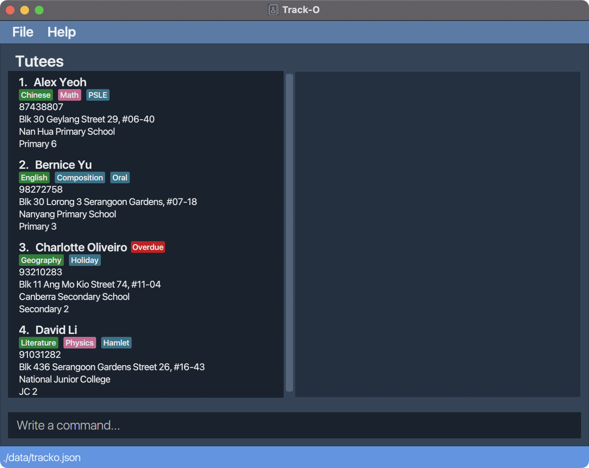

6. Type the command in the command box and press Enter to execute it. e.g. typing **`help`** and pressing Enter will prompt the help window. 
   Some example commands you can try:

   * **`add`**`n/John Doe p/93456789 sch/Temasek Jc l/j2 a/135 Rivervale Link` : Adds a tutee named John Doe with all his relevant information in the tutee list.

   * **`list`** : Lists all tutees.

   * **`delete`**`3` : Deletes the 3rd tutee shown in the tutee list.

   * **`clear`** : Deletes all tutees in the tutee list.

   * **`exit`** : Exits the app.

7. Refer to the [Features](#features) below for details of each command.

--------------------------------------------------------------------------------------------------------------------

## About

This section explains the terms used in the user guide.

If you are an intermediate user, you can hop over to the [Features](#features) section for the details of each command.

If you are an advanced user, you can see all the commands at a glance at the [Command Summary](#command-summary) section.

### Glossary

Terms | Explanation
--------|------------------
command | The text that you enter in the command box. Different commands have different formats.
prefix | A word or letter that ends with `/`. It is a short-handed notation that is used to specify the fields involved in a command. e.g. `n/` indicates that a name is involved.
parameter | A value that is defined based on your input and is immediately preceded by a prefix. e.g. Given a `p/` prefix which represents a phone number, followed by a `PHONE` parameter; if you input `98765432` in place of the `PHONE` parameter, the phone number holds a value of `98765432`.
alphanumeric characters | Words that consist of only English alphabets and/or numbers. Characters such as `@`, `?` and `%` are not alphanumeric. e.g. `2km` 
integer | A number that has strictly no decimal places.
level | Refers to the education level of a student in the context of Singapore's education system.  

### Application layout

--------------------------------------------------------------------------------------------------------------------

## Setting up your first tutee

This section provides a quick guide to adding your first tutee and carrying out your first lesson. For more information
on each command, it can found under the [Features](#Features) section of our guide. To run a command, simply type the command in the command box and hit the `enter` key on your keyboard.

### Before your lesson
1. Let's clear the existing sample data first. Run `clear` to remove the existing tutees.
2. To add in a new tutee, run `add n/John Tan l/p5 a/Hougang Ave 246 sch/Rosyth p/84567890`.
This will add in a tutee with the name `John Tan`, a `Primary 5` student from `Rosyth`, living in `Hougang Ave 246` who can be contacted at `84567890`.
3. To add a lesson for this tutee, run `addlesson 1 subject/Chemistry d/7 s/14:00 e/16:00 rate/30`.
This will add a `Chemistry` lesson from `Sunday 2pm to 4pm` with the rate of `$30` per hour for John.
4. To state a date to receive payment by, run `payment 1 by/05-01-2022`. This means that you expect to collect the fees on
the 5th of January 2022.
 
5. Now run `get 1`. If you performed all the steps correctly, the application should look like this.

### After your lesson
1. To add in the fees of this lesson, run `payment 1 lesson/1`. This will add in the total fees of the first lesson. Since
the rate was `$30` per hour over 2 hours, the final fees adds up to `$60.00`.
2. To add in any remarks for the lesson, run `remark 1 r/Good Progress!` and this set the comments `Good Progress!`
under the remarks for John.
3. If you have collected the fees for this lesson, run `payment 1 receive/` and this resets the payment value to `0.00` and
the pay-by date used in step 4 under **Before your lesson**.

### Tracking your payment of a tutee
1. To view the payment details of John, run `payment 1`. This shows us the existing payment details of John. 
2. To manually overwrite the payment amount John owes, run `payment 1 amount/100`. This sets the amount owed by John to
`$100.00`.
4. To receive the payment and set the next date to pay by in the same command, run `payment 1 receive/05-02-2022`.
This resets the value owed by John to `0` and sets the next date to pay by to `05-02-2022`.

### Managing lessons of tutees
1. To view your schedule for the week, run `schedule` and this displays your upcoming lessons for the week.
2. To add in a new lesson to John, run `addlesson 1 subject/Physics d/6 s/10:00 e/12:00 rate/40`. This will add a `Physics` lesson from `Saturday 10am to 12pm` with the rate of `$40` per hour for John.  
3. To delete the first lesson from John, run `deletelesson 1 lesson/2`. This will delete the second lesson of John which was the `Physics` lesson previously added. 

--------------------------------------------------------------------------------------------------------------------

## Features

**:information_source: Notes about the command format:** 

* Words in `UPPER_CASE` are the parameters to be supplied by the user. 
  e.g. in `add n/NAME`, `NAME` is a parameter which can be used as `add n/John Doe`.

* Items in square brackets are optional. 
  e.g `n/NAME [t/TAG]` can be used as `n/John Doe t/friend` or as `n/John Doe`.

* Items with `…` after them can be used multiple times. 
e.g. `[t/TAG]…` tags are optional can be added multiple times: `t/friend`, `t/friend t/family` etc. 
e.g. `[subject/SUBJECT…]` subject keywords are optional and allows multiple keyword search: `subject/English Math Science`

* Parameters can be in any order. 
  e.g. if the command specifies `n/NAME p/PHONE_NUMBER`, `p/PHONE_NUMBER n/NAME` is also acceptable.

* If a parameter is expected only once in the command but you specified it multiple times, only the last occurrence of the parameter will be taken. 
  e.g. if you specify `p/12341234 p/56785678`, only `p/56785678` will be taken.

* Extraneous parameters for commands that do not take in parameters (such as `help`, `list`, `schedule`, `exit` and `clear`) will be ignored. 
  e.g. if the command specifies `help 123`, it will be interpreted as `help`.

### Viewing help : `help`

Shows a message explaining how to access the help page.

Format: `help`

### Adding a tutee: `add`

Adds a tutee to the existing list of tutees.

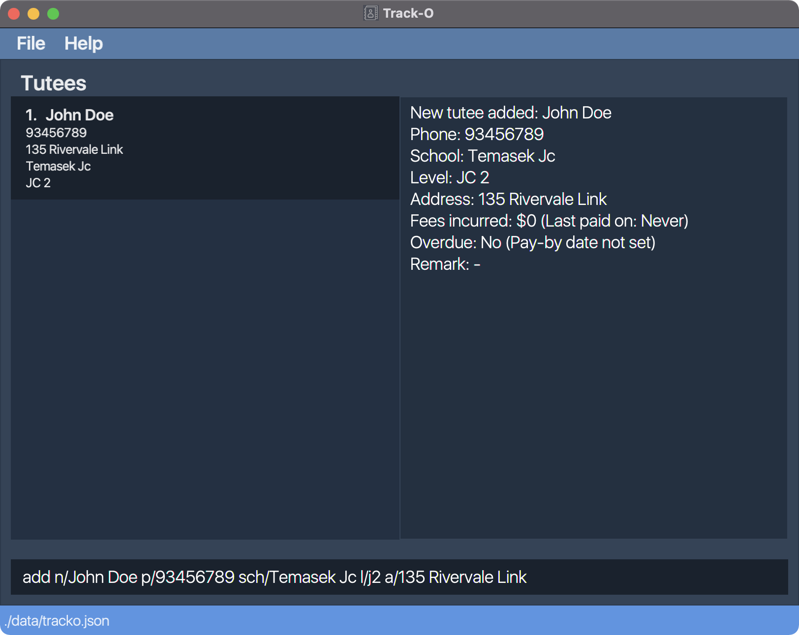

Format: `add n/NAME p/PHONE sch/SCHOOL l/LEVEL a/ADDRESS [t/TAG]…`
* `n/NAME` and `[t/TAG]` can only take in alphanumeric characters and spaces.
* `p/PHONE` should only take in 8-digit phone numbers.
* `l/LEVEL` should only take in `p1` to `p6`, `s1` to `p5`, `j1` to `j2`.
* All entries should **not be blank**.

Examples:
* `add n/John Doe p/93456789 sch/Temasek Jc l/j2 a/135 Rivervale Link`
* `add n/Betsy Crowe l/p5 a/246 Hougang Ave 6 sch/Rosyth p/84567890 t/Northeast region`

### Editing a tutee :  `edit`

Edits an existing tutee in the tutee list.

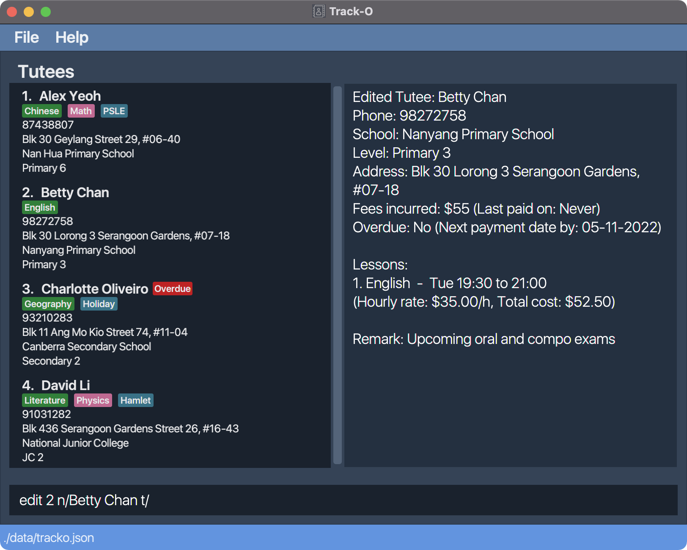

Format: `edit INDEX [n/NAME] [p/PHONE] [sch/SCHOOL] [l/LEVEL] [a/ADDRESS] [t/TAG]…`

* Edits the person at the specified `INDEX`.
* The index refers to the index number shown in the displayed tutee list and **must be a positive integer** 1, 2, 3, …
* At least one of the optional fields must be provided.
* `n/NAME` and `[t/TAG]` can only take in alphanumeric characters and spaces.
* `p/PHONE` should only take in 8-digit phone numbers.
* `l/LEVEL` should only take in `p1` to `p6`, `s1` to `p5`, `j1` to `j2`.
* Existing values will be updated to the input values.
* When editing tags, the existing tags of the tutee will be removed i.e adding of tags is not cumulative.
* You can remove all the tutee’s tags by typing `t/` without specifying any tags after it.
* All entries should **not be blank**.

Examples:
* `edit 1 p/91234567 a/345 Bedok North Ave 3` Edits the phone number and address of the 1st tutee to be `91234567` and `345 Bedok North Ave 3` respectively.
* `edit 2 n/Betty Chan t/` Edits the name of the 2nd tutee to be `Betty Chan` and clears all existing tags.

### Deleting a tutee : `delete`

Deletes the specified tutee from our list of tutees.

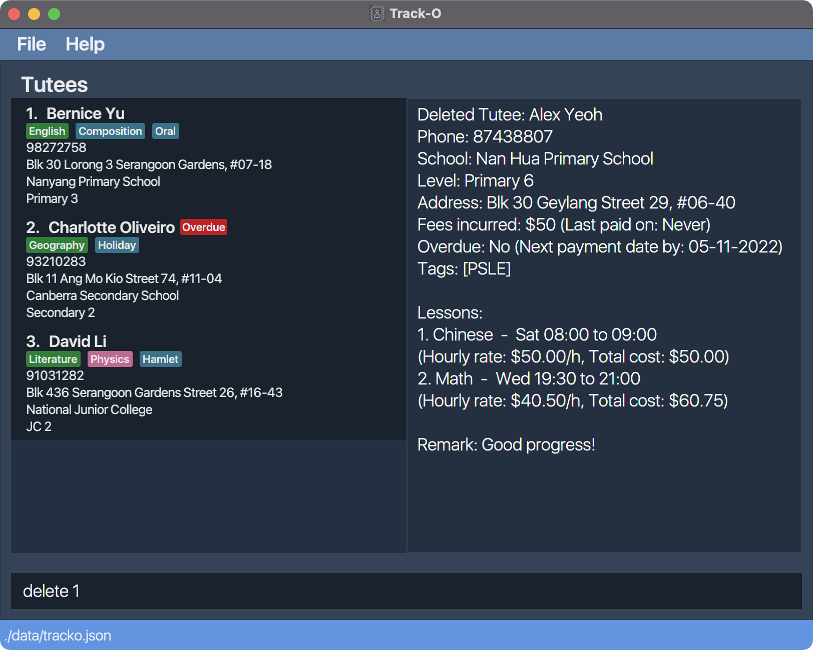

Format: `delete INDEX`

* Deletes the tutee at the specified `INDEX`.
* The index refers to the index number tagged to each tutee in the tutee list.
* The index must be within the size of the tutee list and **must be a positive integer** 1, 2, 3, …

Examples:
* `list` followed by `delete 2` deletes the 2nd tutee in the address book.

### Listing all tutees : `list`

Shows the current list of tutees.

Format: `list`

### Viewing a tutee : `get`

Gets details of the specified tutee from our list of tutees.

Format: `get INDEX`

* Gets the tutee at the specified `INDEX` in the format `Name: John Doe Level: P5`
* The index refers to the index number tagged to each tutee in the tutee list.
* The index must be within the size of the tutee list and **must be a positive integer** 1, 2, 3, …

Examples:
* `list` followed by `get 2` shows the 2nd tutee in the address book.

### Finding tutee by fields : `find`

Filters the tutee list to display matches according to keywords.

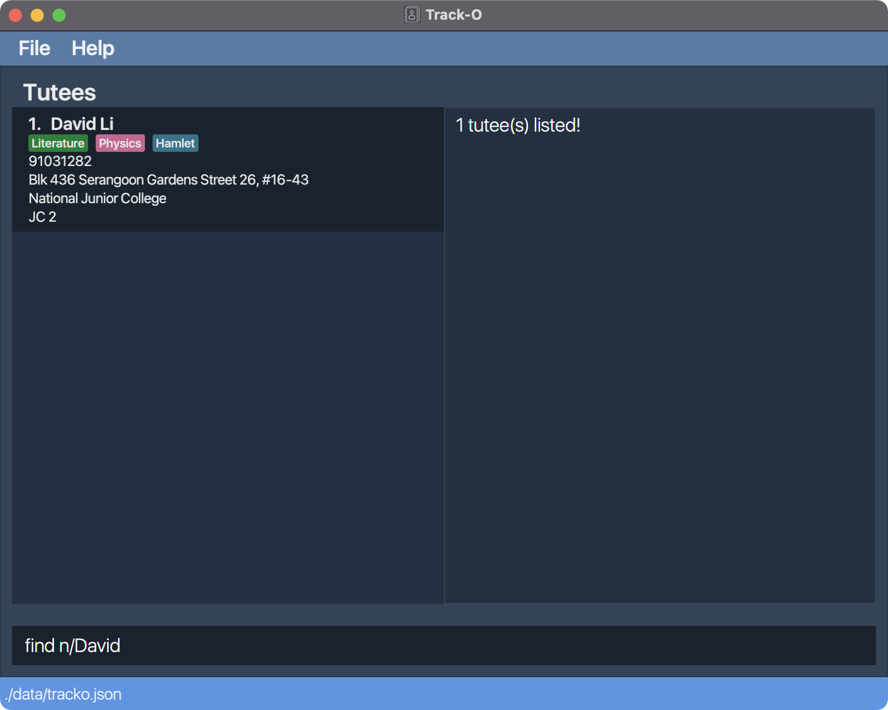

Format: `find [n/NAME…] [subject/SUBJECT…] [l/LEVEL] [overdue/OVERDUE_STATUS]`

* A valid `find` command must have at least 1 of the 4 filters.
* Keywords are case-insensitive.
* The returned tutee list contains matches that fulfills **all** the filters. If the filter has multiple keywords,
only tutees which fulfills **all** keywords will be returned.
* `name` filter can take **multiple keywords** to be matched and can only be alphanumeric characters.
* `subject` filter can take **multiple keywords** to be matched and can only be alphanumeric characters.
* `level` filter can only take **1 keyword** in the form of abbreviation. 
  e.g. `p5` for Primary 5, `s2` for Secondary 2
* `overdue` filter can only take **1 keyword**, either `yes` or `no`.

Example:
* Find all tutees with name containing `David` in the tutee list: `find n/david`.
* Find all tutees with name containing `David` and  `Lee` in the tutee list: `find n/david lee`.
* Find all tutees of level `Secondary 4`: `find l/s4`.
* Find all tutees taking `math` and `physics` classes: `find subject/math physics`.
* Find all tutees taking `math` classes with fees overdue: `find subject/math overdue/yes`.

### Clearing all entries : `clear`

Clears the tutee list and the user's schedule.

Format: `clear`

### Adding a remark to a tutee: `remark`

Adds a remark to the specified tutee with the provided `TEXT` input. New remarks will be appended to existing ones and will not overwrite them.

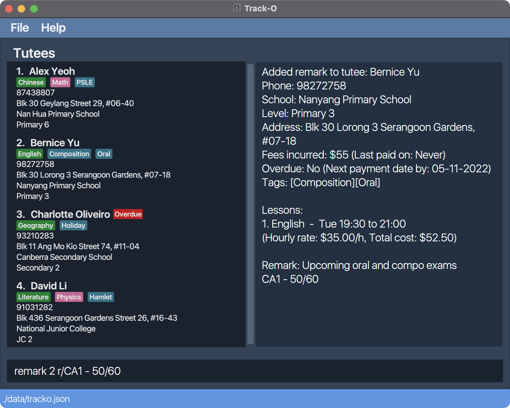

Format: `remark INDEX r/TEXT`

* Adds the desired `TEXT` to the tutee specified at the specified `INDEX`.
* The index refers to the index number tagged to each tutee in the tutee list.
* The index must be within the size of the tutee list and **must be a positive integer** 1, 2, 3, …

Examples:
* `remark 1 r/Went through Organic Chemistry`

### Clearing all remarks of a tutee: `clearremark`

Clears all remarks of the specified tutee.

Format: `clearremark INDEX`

* Clears all remarks of the tutee specified at the specified `INDEX`.
* The index refers to the index number tagged to each tutee in the tutee list.
* The index must be within the size of the tutee list and **must be a positive integer** 1, 2, 3, …

Examples:
* `clearremark 1`

### Adding a lesson to a tutee : `addlesson`

Adds a lesson to the specified tutee from our list of tutees and to the user's schedule.

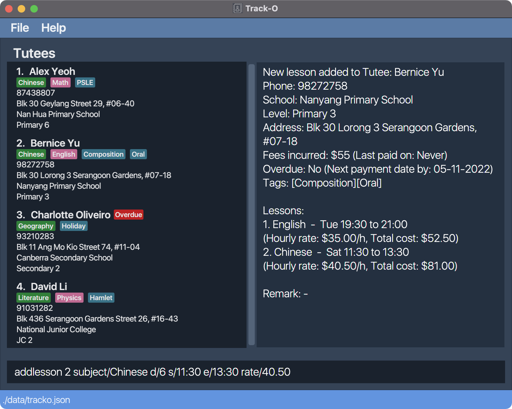

Format: `addlesson INDEX subject/SUBJECT d/DAY_OF_WEEK s/START_TIME e/END_TIME rate/HOURLY_RATE`

* Adds a lesson to the tutee at the specified `INDEX`.
* The index refers to the index number tagged to each tutee in the tutee list.
* The index must be within the size of the tutee list and **must be a positive integer** 1, 2, 3, …
* The lesson occurs on the specified `DAY_OF_WEEK`, from the specified `START_TIME` to the specified `END_TIME`, costing `HOURLY_RATE` dollars per hour.
* `DAY_OF_WEEK` **must be an integer in the range [1, 7]** where `1` to `7` corresponds to Monday to Sunday.
* `START_TIME` and `END_TIME` must be specified in an `HH:MM` format.
* `HOURLY_RATE` **must be a positive number** expressed in either zero decimal places or two decimal places with the last decimal place (i.e. last digit) being `0` or `5`.

Examples:
* `addlesson 1 subject/Biology d/4 s/11:30 e/13:30 rate/40.50`
* `addlesson 2 subject/Math d/5 s/19:30 e/21:30 rate/40.75`
* `addlesson 3 subject/Chemistry d/7 s/08:30 e/09:45 rate/40`

### Deleting a lesson to a tutee : `deletelesson`

Deletes an existing lesson from the specific tutee's lesson list and user's schedule.

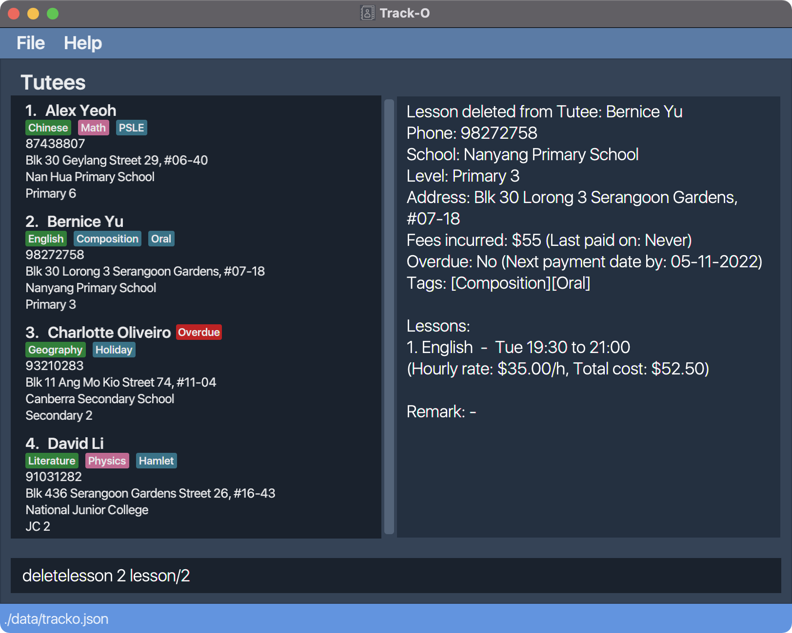

Format: `deletelesson TUTEE_INDEX lesson/LESSON_INDEX`

* The tutee's index is the number displayed beside tutee's name in the filtered tutee's list.
* The lesson index is the number displayed beside the subject name after using `get` command on the tutee.
* `TUTEE_INDEX` and `LESSON_INDEX` are compulsory fields, an error message is produced if either one is missing.

Examples:
* Deleting **lesson 2** from **tutee 3**:
  `deletelesson 3 lesson/2`
* Deleting **lesson 3** from **tutee 1**:
  `deletelesson 1 lesson/3`

### Tracking lesson schedule : `schedule`

Retrieves the user's schedule of lessons.

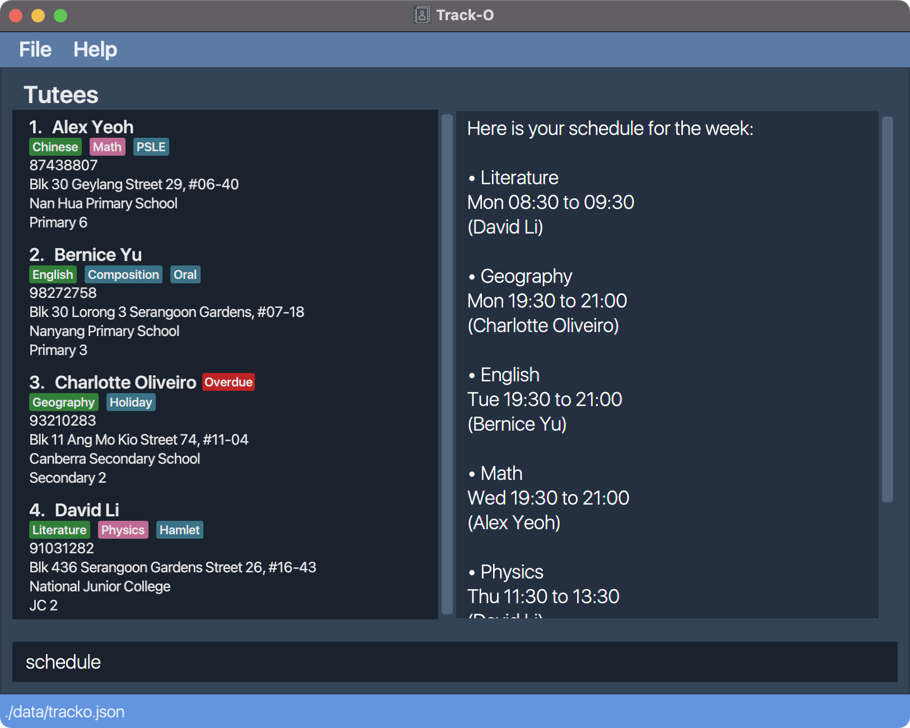

Format: `schedule`

### Tracking tutee payments : `payment`

Retrieves tutee payment details and access to other payment-related commands

#### To retrieve a specified tutee's payment details:

Format: `payment INDEX`

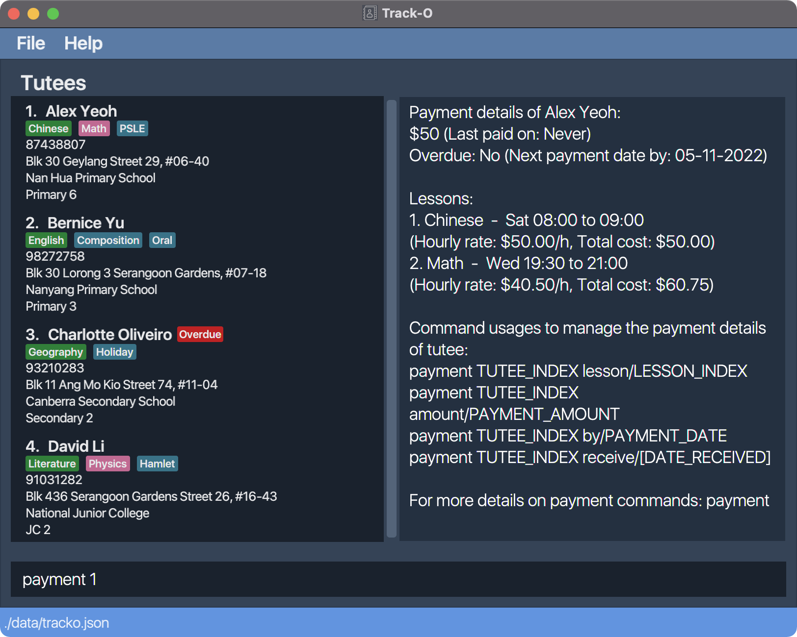

* Retrieves the payment details of the tutee at the specified `INDEX`.
* `INDEX` refers to the index number tagged to each tutee in the tutee list.
* `INDEX` must be within the size of the tutee list and **must be a positive integer** 1, 2, 3, …

Examples:
* `payment 1`

#### To add a specified lesson's fees to a specified tutee:

Format: `payment INDEX lesson/LESSON_INDEX`

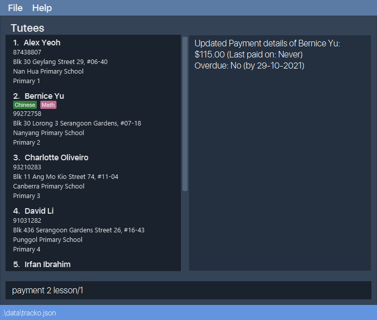

* Adds the fees of the specified lesson at `LESSON_INDEX` to the specified tutee's payment details at `INDEX`.
* `INDEX` refers to the index number tagged to each tutee in the tutee list.
* `INDEX` must be within the size of the tutee list and **must be a positive integer** 1, 2, 3, …
* `LESSON_INDEX` must be within the size of the tutee's lesson list and **must be a positive integer** 1, 2, 3, …

Examples:
* `payment 1 lesson/1`
* `payment 1 lesson/2`

#### To edit a specified tutee's payment amount:

Format: `payment INDEX amount/AMOUNT`

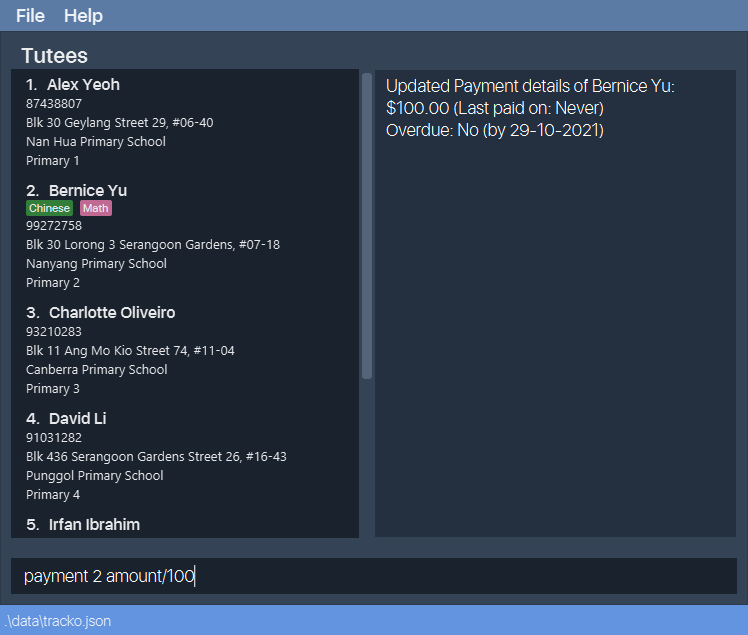

* Changes the payment amount due by the specified tutee at `INDEX` to `AMOUNT`.
* `INDEX` refers to the index number tagged to each tutee in the tutee list.
* `INDEX` must be within the size of the tutee list and **must be a positive integer** 1, 2, 3, …
* `AMOUNT` **must be greater than or equal to 0** expressed in either zero decimal places or two decimal places with the last decimal place (i.e. last digit) being `0` or `5`.

Examples:
* `payment 1 amount/0`
* `payment 1 amount/80.50`
* `payment 2 amount/100`

#### To set a specified tutee's payment due date:

Format: `payment INDEX by/DUE_DATE`

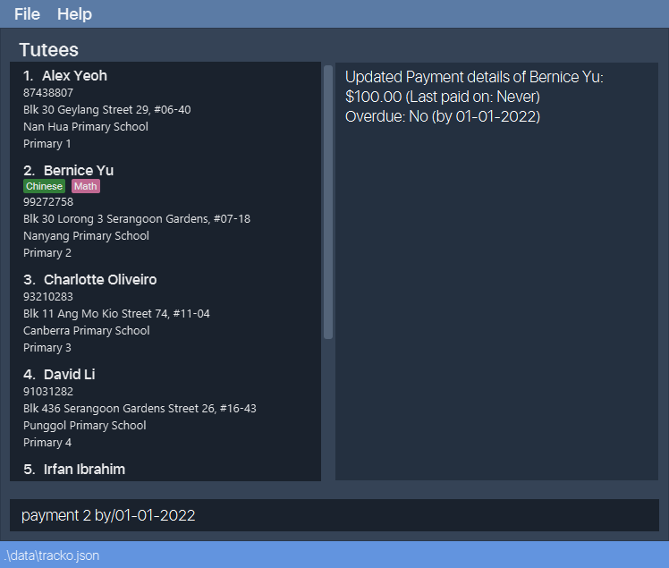

* Changes the payment due date of the specified tutee at `INDEX` to `DUE_DATE`.
* `INDEX` refers to the index number tagged to each tutee in the tutee list.
* `INDEX` must be within the size of the tutee list and **must be a positive integer** 1, 2, 3, …
* `DUE_DATE` **must be later than or on the current date** expressed in the `dd-MM-YYYY` format.

Examples:
* `payment 1 by/25-12-2021`
* `payment 2 by/01-01-2022`

#### To receive a tutee's payment (and set a next payment due date):

Format: `payment INDEX receive/[DUE_DATE]`

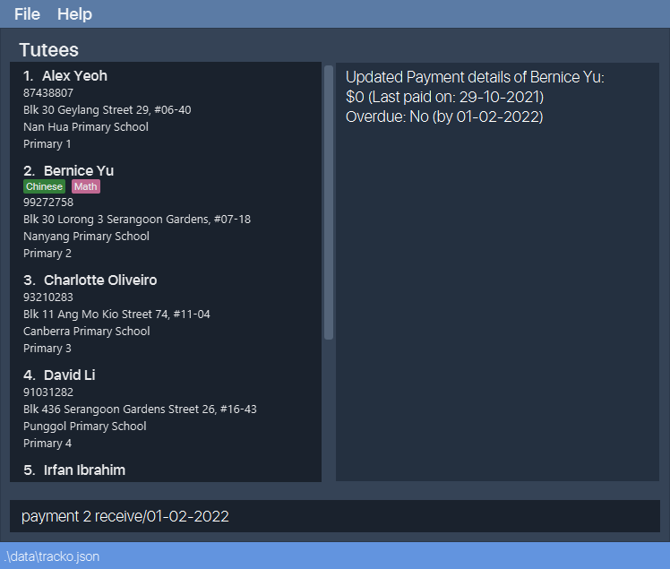

* Resets the payment amount due of the specified tutee to `0`.
* Resets the payment due date of the specified tutee at `INDEX` to `-`, or `DUE_DATE` if specified.
* Updates the specified tutee's last paid date in their payment details to the current date.
* `INDEX` refers to the index number tagged to each tutee in the tutee list.
* `INDEX` must be within the size of the tutee list and **must be a positive integer** 1, 2, 3, …
* `DUE_DATE` **must be later than or on the current date** expressed in the `dd-MM-YYYY` format, if specified.

Examples:
* `payment 1 receive/`
* `payment 2 receive/01-01-2022`

### Exiting application : `exit`

Exits from the application.

Format: `exit`

--------------------------------------------------------------------------------------------------------------------

## FAQ

**Q**: How do I transfer my data to another Computer? 
**A**: Install the app in the other computer and overwrite the empty data file it creates with the file that contains the data of your previous Track-O home folder.

--------------------------------------------------------------------------------------------------------------------

## Command summary

Action | Format, Examples
--------|------------------
**Add** | `add n/NAME p/PHONE sch/SCHOOL l/LEVEL a/ADDRESS [t/TAG]…`   e.g. `add n/James Ho p/87652345 sch/Anderson sec l/s4 a/200 Yio Chu Kang Road`
**Edit** | `edit INDEX [n/NAME] [p/PHONE] [sch/SCHOOL] [l/LEVEL] [a/ADDRESS] [t/TAG]…`   e.g. `edit 2 sch/Victoria Jc l/j1`
**Delete** | `delete INDEX`  e.g. `delete 3`
**List** | `list`
**Get** | `get INDEX`  e.g. `get 2`
**Add remark** | `remark INDEX r/TEXT`   e.g `remark 1 r/Good progress.`
**Clear remarks** | `clearremark INDEX`   e.g `clearremark 1`
**Add lesson to tutee** | `addlesson INDEX subject/SUBJECT d/DAY_OF_WEEK s/START_TIME e/END_TIME rate/HOURLY_RATE`   e.g `addlesson 1 subject/Biology d/4 s/11:30 e/13:30 rate/40.50`
**View schedule** | `schedule`
**Find** | `find [n/NAME…] [l/LEVEL] [subject/SUBJECT…] [overdue/OVERDUE]`  e.g `find n/david subject/math` 
**Clear** | `clear`
**Delete Lesson** | `deletelesson TUTEE_INDEX lesson/LESSON_INDEX`  e.g `deletelesson 2 lesson/1`
**View payment details** | `payment INDEX`   e.g `payment 1`
**Add payment due** | `payment INDEX lesson/LESSON_INDEX`   e.g `payment 1 lesson/1`
**Edit payment due** | `payment INDEX amount/AMOUNT`   e.g `payment 1 amount/80.50`
**Set payment date** | `payment INDEX by/DUE_DATE`   e.g `payment 1 by/01-01-2022`
**Receive payment** | `payment INDEX receive/[DUE_DATE]`   e.g `payment 1 receive/01-02-2022`
**Help** | `help`
**Exit** | `exit`
